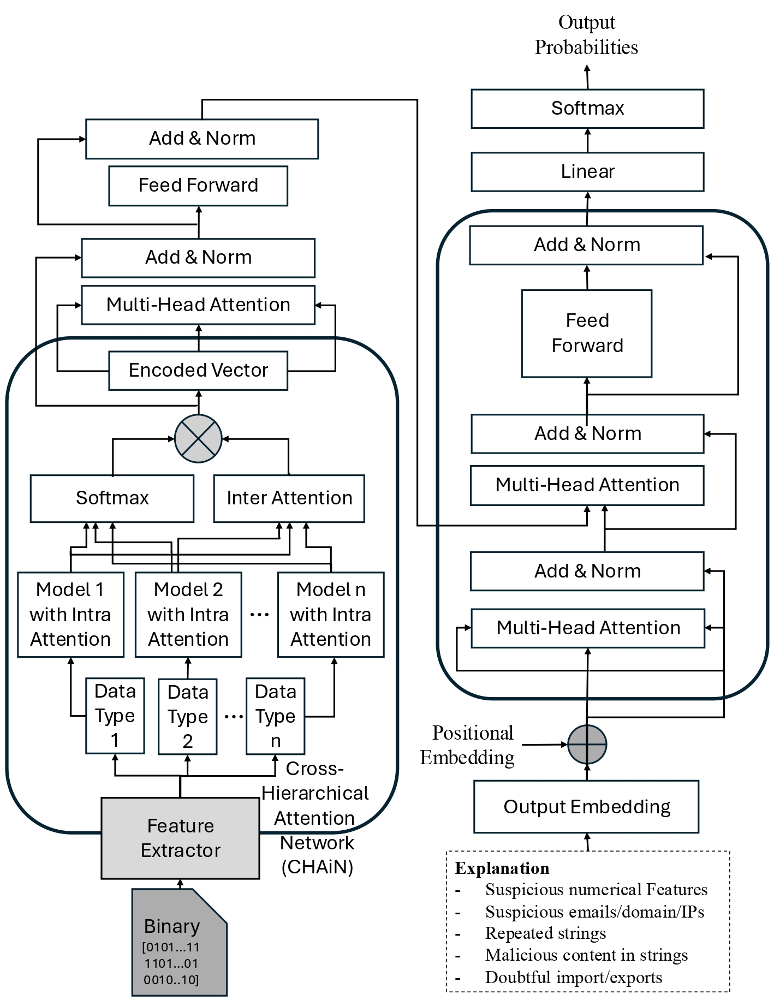

# MalGPT  
**Generative Explainable Model for Malware Binaries**

<p align="center">
  
</p>

---

## Project Overview

MalGPT is a novel multi-modal generative explainable AI model designed for malware binary analysis. It integrates diverse feature modalities, including PE header features, import/export structures, printable strings, and Canonical Executable Graphs (CEGs). MalGPT leverages a Cross-Hierarchical Attention Network (CHAiN) to capture intra- and inter-modality relationships, followed by a GPT-style decoder to generate natural language explanations of malware behaviors. This repository contains the implementation code, dataset, and pretrained models used in our ECML-PKDD 2025 paper.

---

<p align="center">
  
</p>

## Repository Structure

### Branches

- **`main`** — Source code of MalGPT.
  - The `MalGPT` folder contains the encoder-decoder architecture organized into separate modules.
  - The `assets` folder contains supplementary material related to the paper appendix.

- **`data`** — Dataset and binary files used for training and evaluation.
  - Structure:
    ```
    /MalGPT_DATA_toUpload/
      ├── explanations-small/      # Contains explanation files for small dataset
      ├── explanations/            # Full explanation dataset
      ├── filename_MD5.xlsx        # File containing filenames with corresponding MD5 hash values
      └── label_filename.xlsx      # File mapping filenames to malware families
    ```
  - The `label_filename.xlsx` file includes malware family labels for each file.
  - The `filename_MD5.xlsx` file includes hash values (MD5), which can be used to verify files or retrieve reports from sources such as VirusTotal.

---

## Key Features

- Multi-modal feature extraction combining static, dynamic, and structural data.
- CHAiN: Cross-Hierarchical Attention Network to integrate intra- and inter-modality dependencies.
- GPT-based generative explanation model to produce human-readable natural language explanations.
- First publicly available dataset pairing malware binaries with corresponding explanations.
- Comprehensive evaluation on both malware detection and explainability tasks.

---

## Dataset Details

The dataset consists of ~23.3 GB of binaries across five categories:

- Malware Families: DownloadAdmin, Firseria, Emotet, Gamarue
- Benign Files

Each sample includes:

- PE header features (entropy, resource size, import/export counts)
- Import/export functions (API call embeddings using SBERT)
- Printable strings (URLs, emails, IPs, directories, keywords)
- Canonical Executable Graph (CEG) features extracted from assembly code
- VirusTotal reports used to generate natural language explanations via ChatGPT API

The dataset represents the first pairing of malware binaries with ground-truth natural language explanations.

---

## Model Architecture

MalGPT is built using a two-stage architecture:

1. **Encoder: CHAiN (Cross-Hierarchical Attention Network)**
    - Processes heterogeneous features using intra-modality and inter-modality attention mechanisms.
    - Fuses PE headers, imports/exports, printable strings, and graph-based embeddings.

2. **Decoder: GPT-style Transformer**
    - Generates natural language explanations from fused embeddings using transformer decoder blocks.

---

## Performance Summary

- Malware detection accuracy: **98%**
- Precision: **98.8%**
- Recall: **98.6%**
- F1-score: **98.6%**
- ROUGE-L: **8.20%**
- BERTScore: **81.40%**

---

## Citation

If you find this project useful, please cite:

> M. Saqib, B. C. M. Fung, S. H. H. Ding, and P. Charland. MalGPT: a generative explainable model for malware binaries. In Proceedings of the European Conference on Machine Learning and Principles and Practice of Knowledge Discovery in Databases (ECML PKDD), 18 pages, Porto, Portugal: Springer, September 2025.

---

## Clone Instructions

```bash
# Clone the full repository
git clone https://github.com/McGill-DMaS/MalGPT.git
cd MalGPT

# Fetch all branches
git fetch --all

# Checkout main branch (code)
git checkout main

# Checkout data branch
git checkout data
